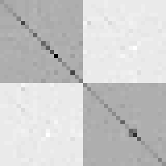

# Label Consistent Fisher Vectors (LCFV)

[](https://www.mathworks.com/matlabcentral/fileexchange/47730-label-consistent-fisher-vectors-lcfv)

## Table of Contents

- [Overview](#overview)
- [Installation](#installation)
- [Usage](#usage)
  - [Prepare Data](#prepare-data)
  - [LCFV1](#lcfv1)
  - [LCFV2](#lcfv2)
- [Citation](#citation)

## Overview

LCFV is a method for adding supervised information to Fisher vectors. This package allows you to compute a transformation matrix to be applied to Fisher vectors, taking the original Fisher vectors and class labels as input.

**Note**: This package does **not** provide code for computing Fisher vectors. You must compute them yourself before using this package (e.g., using [INRIA's Fisher vector implementation](http://lear.inrialpes.fr/src/inria_fisher/)).

The method is described in our ICPR 2014 paper:

> Quan Wang, Xin Shen, Meng Wang, Kim L. Boyer, "Label Consistent Fisher Vectors for Supervised Feature Aggregation", 22nd International Conference on Pattern Recognition (ICPR), 2014.



## Installation

You can clone this repository or download it from MATLAB File Exchange.

```bash
git clone https://github.com/wangquan/LCFV.git
```

## Usage

Please check `code/run_demo.m` for a complete example.

### Prepare Data

You need:
- `fv`: Fisher vectors matrix (dimension `N x D` or transposed).
- `labels`: Class labels.

### LCFV1

```matlab
% G: Fisher vectors (D x N)
% C: Label comparison matrix
% alpha: Parameter (tune this!)

[M1, W1] = solve_LCFV1(G, C, alpha);
LCFV1 = M1 * G;
```

### LCFV2

```matlab
M2 = solve_LCFV2(G, C, alpha);
LCFV2 = M2 * G;
```

## Citation

If you use this code for academic purposes, please cite our paper:

```bibtex
@inproceedings{wang2014label,
  title={Label consistent Fisher vectors for supervised feature aggregation},
  author={Wang, Quan and Shen, Xin and Wang, Meng and Boyer, Kim L},
  booktitle={Pattern Recognition (ICPR), 2014 22nd International Conference on},
  pages={2507--2512},
  year={2014},
  organization={IEEE}
}
```

This library is also available at MathWorks:
https://www.mathworks.com/matlabcentral/fileexchange/47730-label-consistent-fisher-vectors-lcfv

